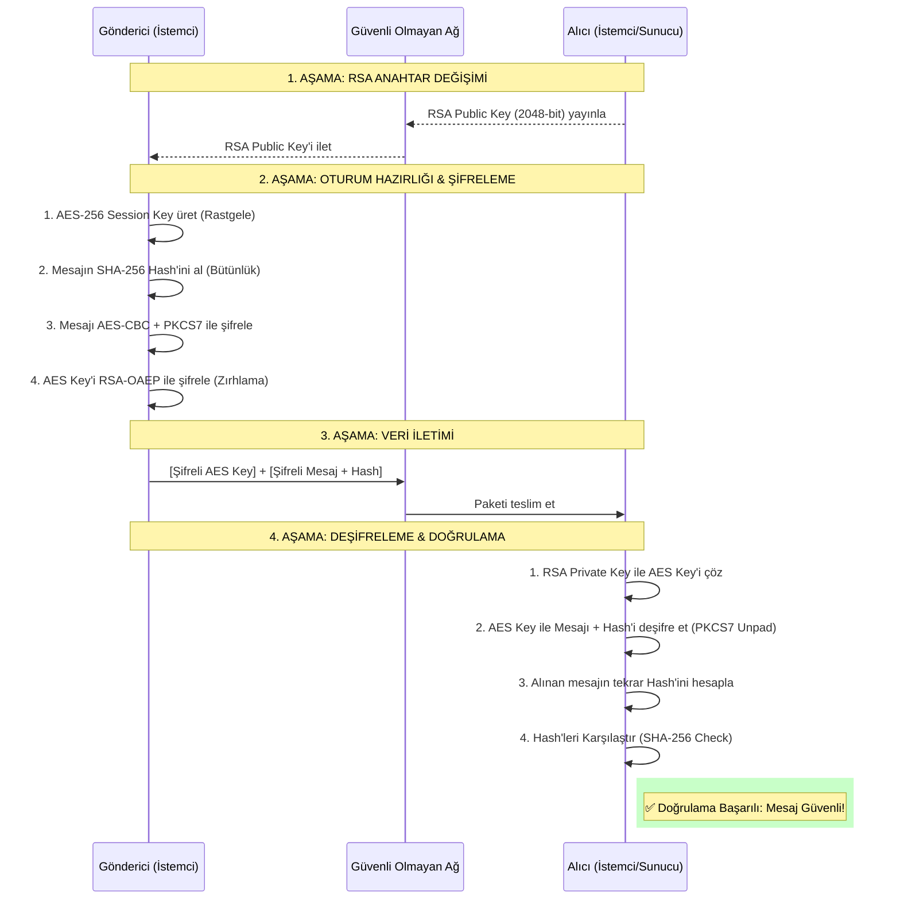

# 🛡️ SecureChat: Uçtan Uca Şifreli (E2EE) CLI İletişim Protokolü

**Geliştirici:** Enes Osman Çolak - 23631039

**Teknoloji Yığını:** Python 3.10+, PyCryptodome, TCP/IPv4 Socket, Multi-threading

**Mimari Sınıfı:** Hibrit Kriptografi (Asymmetric Key Exchange + Symmetric Cipher + MAC)

---

## 1. Projenin Amacı ve Tehdit Modeli (Threat Model)

Güvensiz ağ topolojilerinde (açık Wi-Fi ağları, kampüs ağları, ISS düzeyinde paket izleme) haberleşen iki uç birim (Host ve Client) arasındaki iletişim, dışarıdan müdahalelere son derece açıktır. 

Bu proje, TCP/IP yığını üzerinde sıfırdan inşa edilmiş, **Gizlilik (Confidentiality)**, **Bütünlük (Integrity)** ve **Doğrulanabilirlik (Authentication)** ilkelerini (CIA Triad) donanımsal ve yazılımsal düzeyde sağlayan bir haberleşme protokolüdür.

### Sistem Mimarisi - Saldırı Vektörleri

Sistem mimarisi, aşağıdaki spesifik saldırı vektörlerine karşı **"Sıfır Güven" (Zero Trust)** prensibiyle tasarlanmıştır:

#### 1. **Ağ Dinleme (Sniffing/Eavesdropping)**
- Taşıma katmanındaki paketlerin Wireshark/tcpdump ile yakalanması
- **Koruma:** AES-256 ile engellenir

#### 2. **Ortadaki Adam (MITM / ARP Spoofing)**
- Araya giren saldırganın paketleri okuması veya yönlendirmesi
- **Koruma:** RSA-2048 ile asimetrik anahtar takası

#### 3. **Veri Manipülasyonu (Malleability/Bit-Flipping)**
- Şifreli paketlerin bit değerlerinin ağ üzerinde değiştirilerek alıcı sistemin çökertilmesi veya verinin bozulması
- **Koruma:** HMAC-SHA256 mühürleme mekanizması

#### 4. **Tekrar (Replay) Saldırıları**
- Yakalanan geçerli bir şifreli paketin ağa tekrar enjekte edilmesi
- **Koruma:** CSPRNG tabanlı benzersiz Başlangıç Vektörü (IV)

---

## 2. Ağ Katmanı ve Soket Mimarisi (L4 Transport)

Projenin ağ haberleşmesi, düşük seviyeli işletim sistemi çağrıları (syscall) kullanılarak yapılandırılmıştır.

### 2.1. Bağlantı Protokolü ve Port Yönetimi

#### **TCP/IPv4 Standardı**
- Uygulama, `AF_INET` adresleme ailesi ve `SOCK_STREAM` protokolü üzerinde çalışır
- Kriptografik blokların sırasının bozulması şifreleme zincirini kıracağı için paket kayıplarını tolere eden UDP yerine, iletim garantisi sunan TCP tercih edilmiştir

#### **Zombi Port ve TIME_WAIT İzolasyonu**
- İstemcinin aniden kopması veya uygulamanın çökmesi durumunda kernel, güvenlik amacıyla kullanılan portu (5555) TIME_WAIT statüsüne alır
- Sistemde `SO_REUSEADDR` soket bayrağı aktif edilerek "Address already in use" hatası donanımsal düzeyde bypass edilmiş
- Portun anında yeniden tahsis edilmesi sağlanmıştır

### 2.2. DDoS ve Tarayıcı Koruması (Application-Layer Handshake)

Açık portların Nmap, Masscan gibi zafiyet tarayıcılar tarafından tespit edilip kaynak tüketimi saldırılarına maruz kalmasını önlemek için TCP el sıkışmasından hemen sonra 3 adımlı bir matematiksel doğrulanabilirlik katmanı eklenmiştir.

**İşleyiş:**
1. Sistem, bağlantı kuran istemciye donanımsal rastgelelikte bir **Challenge** yollar
2. İstemci, kaynak koda gömülü olan `(Challenge × 2) + 7` denklemini çözerek **Response** üretir
3. Otomize botlar bu uygulama katmanı mantığını çözemediği için bağlantıları anında **REJECT** edilir ve TCP soketi kapatılır
4. CPU'yu yoran RSA şifreleme işlemlerine sadece bu doğrulama geçildikten sonra başlanır

---

## 3. Asimetrik Kriptografi ve Anahtar Takası (RSA-2048 & OAEP)

Sistemin en kritik aşaması, uçların birbirini tanımadığı bir ağda ortak bir gizli anahtar üzerinde güvenle anlaşabilmesidir. 

Simetrik algoritmaların **"Anahtar Dağıtımı Zafiyeti"** (Key Distribution Problem), RSA kullanılarak aşılmıştır.

### 3.1. Dinamik Anahtar Üretimi ve İletimi

#### **Forward Secrecy Temelleri**
- Bağlantı kurulduğu an, her iki cihaz kendi RAM belleklerinde 2048-bit uzunluğunda birer Public/Private Key çifti üretir
- Anahtarlar asla diske yazılmaz (.pem dosyası olarak kaydedilmez)
- Program sonlandığında anahtarlar uçucu bellekten silinir

#### **Açık Anahtar Takası**
- Uç birimler, `export_key()` metodu ile oluşturdukları Public Key'lerini ağ üzerinden birbirlerine düz metin olarak iletir
- Bu anahtarlar sadece kilitleme işlemi yapabildiği için ağda dinlenmesi bir güvenlik zafiyeti yaratmaz

### 3.2. Hibrit Yapı ve AES Anahtarının Zırhlanması

1. **Ana Simetrik Anahtar Üretimi**
   - Host makine, tüm sohbeti şifreleyecek olan 32-Byte'lık (256-bit) ana simetrik oturum anahtarını (AES Session Key) üretir

2. **PKCS#1 OAEP Padding**
   - Üretilen AES anahtarı, ağa çıkarılmadan önce karşı tarafın Public Key'i ile RSA algoritmasından geçirilerek şifrelenir
   - Eski standart PKCS#1 v1.5 yerine, Padding Oracle saldırılarına karşı matematiksel direnci kanıtlanmış **PKCS1_OAEP** (Optimal Asymmetric Encryption Padding) kullanılmıştır

3. **Güvenli Gönderim**
   - Sadece ağın diğer ucundaki doğru Private Key'e sahip cihaz bu zırhı çözebilir ve AES anahtarını hafızasına alabilir

---

## 4. Simetrik Şifreleme Motoru (AES-256 CBC)

Simetrik oturum anahtarı güvenle paylaşıldıktan sonra, veri akışı düşük gecikme süresi (low-latency) için donanım seviyesinde optimize edilmiş AES standardına devredilir.

### 4.1. Şifreleme Modu ve Rastgelelik (CSPRNG)

#### **CBC (Cipher Block Chaining) Modu**
- ECB modundaki veri bloğu tekrarlama zafiyetini (aynı metnin aynı şifreli çıktıyı üretmesi) önlemek amacıyla CBC modu kullanılmıştır
- Her bir 16-Byte veri bloğu, şifrelenmeden önce bir önceki şifreli blok ile XOR işlemine tabi tutulur

#### **Benzersiz IV (Initialization Vector)**
- CBC zincirini başlatmak için her bir mesaja özel 16-Byte'lık yüksek entropili IV üretilir
- Python'un güvensiz `random` modülü yerine, kriptografik donanım gürültüsünü kullanan `secrets.token_bytes()` (CSPRNG) tercih edilmiştir
- Bu, sistemin Replay (Tekrar) saldırılarına karşı bağışıklık kazanmasını sağlar

### 4.2. Blok Tamamlama (PKCS#7 Padding)

- AES, verileri katı bir şekilde 16 Byte'lık kalıplar halinde işler
- Gönderilen veri boyutunun bu kurala uymadığı durumlarda, eksik baytlar **Crypto.Util.Padding** kütüphanesi üzerinden PKCS#7 standardı ile dinamik olarak doldurulur
- Alıcı tarafında deşifre işlemi sonrası orijinal veriden (unpad) temizlenir

---

## 5. Veri Bütünlüğü ve Kriptografik Mühürleme (HMAC-SHA256)

Şifreleme (Encryption) veriyi okunmaz hale getirir ancak bütünlüğünü garanti etmez. 

Saldırganın şifreli metin üzerindeki baytları değiştirerek **Malleability** saldırısı yapmasını önlemek için sistem **"Encrypt-then-MAC"** (Önce Şifrele, Sonra Mühürle) paradigması ile inşa edilmiştir.

### 5.1. Dijital İmza Üretimi

- AES motorundan çıkan şifreli veri (IV + Ciphertext), RSA aşamasında paylaşılan gizli AES Session Key ile birlikte HMAC fonksiyonuna sokulur
- Özetleme motoru olarak collision (çakışma) direnci yüksek SHA-256 kullanılarak paketin sonuna 32 Byte'lık bir imza (Signature) eklenir

### 5.2. Manipülasyon Tespiti ve İstisna Yönetimi

- Alıcı uç, paketi teslim aldığında AES motorunu çalıştırmadan önce, kendi gizli anahtarı ile paketin HMAC mührünü baştan hesaplar
- Ağdan gelen mühür ile lokalde hesaplanan mühür uyuşmazsa, Ortadaki Adam (MITM) veya hat gürültüsü nedeniyle veri bozulmuş demektir
- Sistem anında `ValueError` fırlatır, şifre çözme motorunu riskli veriyle beslemeyi reddeder ve paketi izole ederek **❌ [GÜVENLİK İHLALİ]** uyarısı verir

---

## 6. Asenkron G/Ç (I/O) ve Taşıma Katmanı Veri Formatı

CLI arayüzlerinin doğası gereği `input()` fonksiyonları Thread blokajına (Blocking I/O) neden olur. 

Sistemde **"Full-Duplex"** (Çift Yönlü Eşzamanlı) iletişimi sağlamak için işletim sistemi seviyesinde çoklu iş parçacığı (Multi-threading) mimarisi uygulanmıştır.

### 6.1. Daemon Threading

- Ağ arayüzünden gelen paketleri dinleyen soket (`recv`), `threading.Thread` objesi olarak ana process'ten ayrıştırılmış ve `daemon=True` bayrağı ile işaretlenmiştir
- Bu sayede ana döngü klavye girişlerini dinlerken, arka plandaki thread ağ trafiğini gecikmesiz olarak arayüze yansıtır

### 6.2. Veri Taşıma Formülasyonu (Base64 & UTF-8)

Şifrelenmiş ham (Raw Byte) dizilerinde null byte (`\x00`) veya EOF gibi ağ yönlendiricileri (Router, Switch) tarafından hatalı yorumlanabilecek kontrol karakterleri bulunabilir. 

Paket parçalanmasını engellemek için ağa gönderilen her veri çerçevesi (Frame) aşağıdaki gibi **Base64** formatında kodlanarak %100 ASCII uyumlu hale getirilmiştir:

```
Payload = Base64_Encode(
    [16-Byte IV] + 
    [N-Byte Ciphertext (PKCS7)] + 
    [32-Byte HMAC_Signature]
)
```

---

## 7. Güvenlik ve Sızma Testi (Pen-Test) Senaryoları Değerlendirmesi

Geliştirilen protokol üzerinde lokal ağ koşullarında gerçekleştirilen yapısal testlerin bulguları:

### 7.1. Ağ Dinleme (Wireshark) Testi
- **Bulgu:** TCP stream analizi sonucunda, başlangıçtaki açık RSA anahtar takasları haricinde tüm trafik Base64 kodlu şifreli bloklar olarak tespit edilmiştir
- **Sonuç:** Düz metin (Plaintext) veya oturum anahtarına dair hiçbir entropi sızıntısı gözlemlenmemiştir

### 7.2. Sabotaj ve Manipülasyon Testi
- **Test Yöntemi:** Koda entegre edilmiş `!sabote` komutu ile AES şifreleme aşaması bypass edilerek ağa kasten bozuk bir Base64 dizisi enjekte edilmiştir
- **Sonuç:** Karşı ucun bütünlük katmanı, bozuk veriyi AES deşifre motoruna girmeden HMAC doğrulaması aşamasında (mikrosaniyeler içinde) tespit etmiş ve sistem güvenliğini başarıyla sağlamıştır

### 7.3. Forward Secrecy Testi
- **Test Yöntemi:** Uygulama her yeniden başlatıldığında asimetrik ve simetrik anahtar havuzunun tamamen değiştiği bellek dökümleriyle (Memory Dump) doğrulanmış
- **Sonuç:** Geçmiş paketlerin şifresinin çözülmesinin matematiksel olarak engellendiği kanıtlanmıştır

---

## 📊 Sistem İşleyiş Diyagramı (Sequence Diagram)

Aşağıdaki şema, bağlantı anından itibaren gerçekleşen kriptografik el sıkışma ve veri iletim sürecini göstermektedir:



---

## 🔐 Teknik Özellikler Özeti

| Özellik | Değer |
|---------|-------|
| **Asimetrik Şifreleme** | RSA-2048 + PKCS#1 OAEP |
| **Simetrik Şifreleme** | AES-256-CBC |
| **Oturum Anahtarı** | 32 Byte (256-bit) |
| **Bütünlük Algoritması** | HMAC-SHA256 |
| **İlklenme Vektörü** | CSPRNG tabanlı 16-Byte IV |
| **Ağ Protokolü** | TCP/IPv4 |
| **Bağlantı Noktası** | 5555 |
| **Multi-Threading** | Daemon Thread (Full-Duplex) |
| **Padding Standardı** | PKCS#7 |
| **Kodlama Formatı** | Base64 |

---

## ⚙️ Kurulum ve Kullanım

```bash
# Gerekli kütüphaneleri yükle
pip install pycryptodome

# Sunucu başlat
python server.py

# İstemci bağlantısı
python client.py
```

---

**Son Güncelleme:** 2026-05-04  
**Lisans:** MIT  
**Durum:** ✅ Aktif Geliştirme
